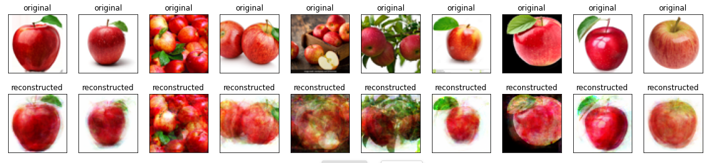

The use and accessibility of machine learning and artificial intelligence has increased greatly over just the past few years. One application of this technology is 
art. AI art has been used across mediums in performances, visual pieces, music, interactive displays, and more. As AI technology continues to get more advanced, 
these projects push us to consider how we define art and how artificial intelligence will fit into our future world. For example, Stephanie Dinkins created an 
interactive talking sculpture with AI trained on oral history from a black American family (Dinkins). The piece is meant to explore the concerns and ideals of 
communities underrepresented in tech (Dinkins). Another artist, Tom White, used AI to create abstract illustrations that can be reliably classified by neural 
networks (Tom). This work allows us to see a part of how AI processes images. 

This project seeks to explore a neural network that can transform images into unique abstract art. The neural network is an autoencoder that can be trained on virtually any set of images and, after training, transform a new set of images. The code for the project uses the Tensorflow library in order to train an autoencoder on a set of images. Once trained, the autoencoder can be used to transform a new set of images into abstract art that is visually similar to the training set. The user can choose any type and number of images they want to train on. Similarly, the user can use any images they wish to transform, and they can choose up to ten of them at one time.

## Results

It was found that more visually interesting results can be achieved by using visually similar training images. One type of images that worked particularly well were images of a single type of fruit. The images below were obtained by training the autoencoder on images of apples, bananas, and oranges respectively, then inputting images of artworks to be transformed.

Most machine learning algorithms rely on huge amounts of data and ideally data that covers many scenarios. In this case, a neural network that was good at replicating a specific type of image was desired. It was best for the images to be very visually similar, and it was appropriate to have a small training set since the images were similar. In a sense, a biased result was desired. If the autoencoder was able to recreate the image accurately, the results would not be very unique. 

In contrast to the images above, the below images show other trials. The first is from an autoencoder trained on 95 images of apples (trained the same way as the results above), then given more apple images. While it is interesting to see the images recreated fairly accurately, the output would not likely be considered art by most. The second image below is from an autoencoder trained on about 15,000 images of portraits, then given five new portraits. Although these results are more accurate to the original images, they aren't particularly interesting.

This project is an example of the fact that the consequences of artificial intelligence algorithms are often less about the algorithms themselves and more about the data put into them and the biases in that data. While there are not many ethical risks associated with this particular project, many AI projects have the power to do harm when they are biased. AI art can bring up a larger conversation about what art is and how humans will continue to coexist with artificial intelligence. 

link to usage instructions in README [here](https://github.com/annacommers/neural-network-art#usage)

[Download the project](https://github.com/annacommers/neural-network-art.git)

## Sources

“Tom White.” CADAF, 2019, cadaf.art/artists/tom-white-1. 
Dinkins, Stephanie. “Not the Only One.” STEPHANIE DINKINS, 2018, www.stephaniedinkins.com/ntoo.html. 

## About me

My name is Anna Commers and I am a student at Olin College of engineering. I am passionate about human centered design, software, and art. This project was made for the Software Design class at Olin College.
